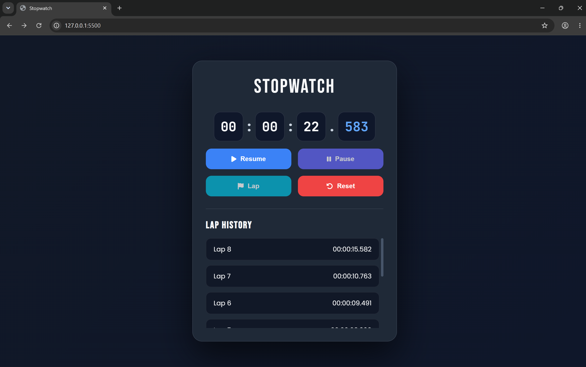
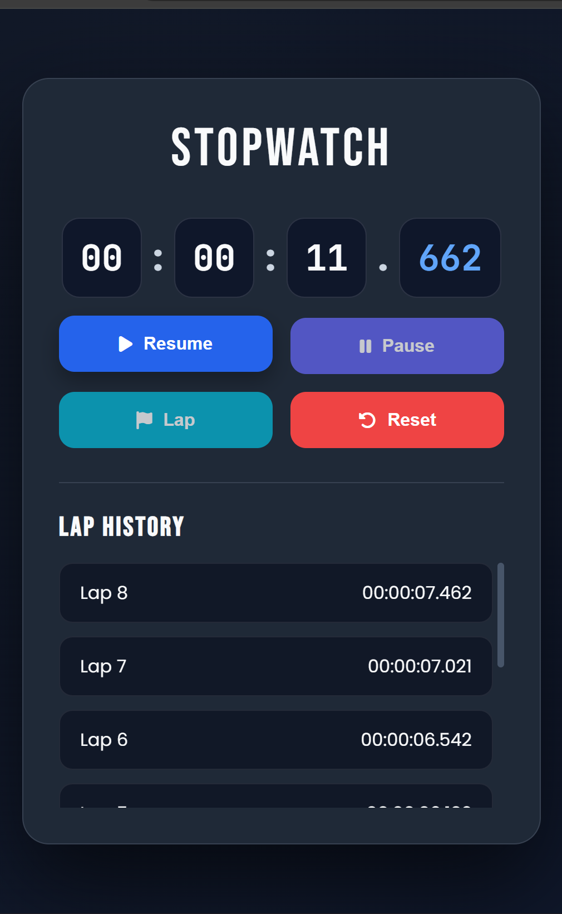

# ⏱️ Stopwatch Web Application


<<<<<<< HEAD

=======
>>>>>>> 9ecfa61ad48c49a3f2e1304314e06cb2ed53c97f

A modern and responsive **Stopwatch Web Application** built using **HTML, CSS, and JavaScript**. This project provides accurate time tracking with essential stopwatch functionalities, including **Start, Pause, Reset, Lap Recording**, and **Keyboard Shortcuts**. Designed with a clean dark-themed interface, it delivers a smooth user experience across desktop and mobile devices.

---

## 🚀 Live Demo

🔗 **Live Website:** https://agrawal-pratik.github.io/SCT_WD_2/

---

## 📸 Screenshots

### Desktop View

<p align="center">
  
</p>

### Mobile View

<p align="center">
  
</p>

---

## ✨ Features

- ⏱️ Accurate stopwatch with millisecond precision
- ▶️ Start, Pause, Resume, and Reset functionality
- 🏁 Record unlimited lap times
- 📋 Scrollable Lap History
- ⌨️ Keyboard shortcuts
  - **Space** → Start / Pause
  - **L** → Record Lap
  - **R** → Reset
- 📱 Fully Responsive Design
- 🌙 Modern Dark UI
- ⚡ Smooth animations and hover effects
- ♿ Improved accessibility with keyboard focus states

---

## 🛠️ Built With

- HTML5
- CSS3
- JavaScript (ES6)
- Font Awesome
- Google Fonts

---

## 📂 Project Structure

```
SCT_WD_2/
│── index.html
│── style.css
│── script.js
│── README.md
└── screenshots/
    ├── desktop.png
    └── mobile.png
```

---

## 🎮 Keyboard Shortcuts

| Key | Action |
|------|--------|
| Space | Start / Pause |
| L | Record Lap |
| R | Reset Stopwatch |

---

## 🚀 Getting Started

### Clone the Repository

```bash
git clone https://github.com/agrawal-pratik/SCT_WD_2.git
```

### Open the Project

Simply open **index.html** in your browser or use **Live Server** in VS Code.

---

## 💡 Learning Outcomes

Through this project, I strengthened my understanding of:

- JavaScript DOM Manipulation
- Event Handling
- Timer Functions (`setInterval`)
- Responsive Web Design
- CSS Grid & Flexbox
- UI/UX Design Principles
- Keyboard Accessibility
- Git & GitHub Workflow

---

## 📌 Internship Task

This project was developed as **Task 02** during my **Web Development Internship** at **SkillCraft Technology**.

---

## 👨‍💻 Author

**Pratik Agrawal**

- GitHub: https://github.com/agrawal-pratik
- LinkedIn: *(Add your LinkedIn Profile URL here)*

---

## ⭐ Support

If you found this project helpful, consider giving it a ⭐ on GitHub!
